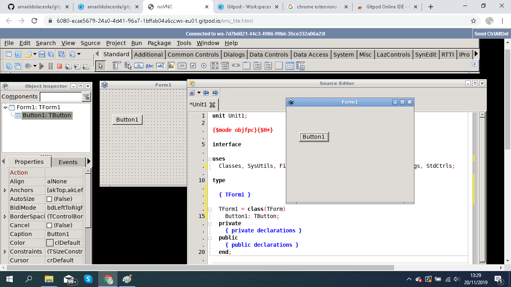
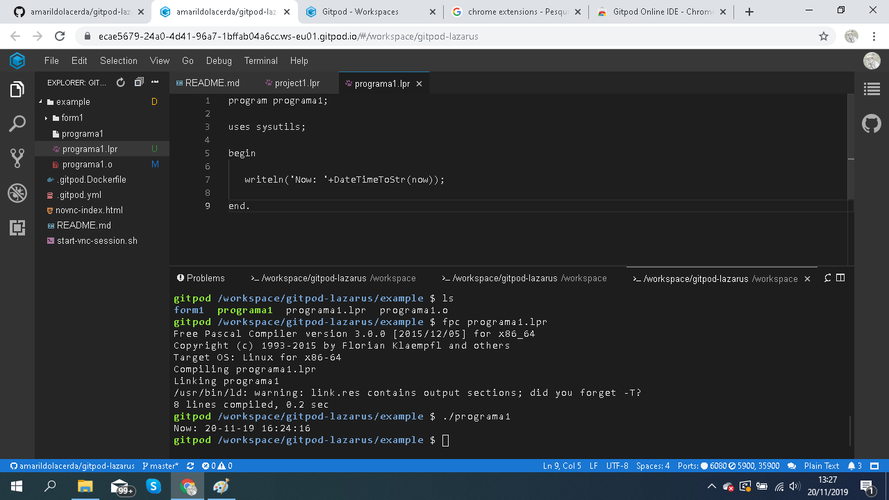

# gitpod-lazarus
Rodando FPC e Lazarus no Docker do GitPod

<b>Como Usar</b>
- instale no chrome a extenção: https://chrome.google.com/webstore/detail/gitpod-online-ide/dodmmooeoklaejobgleioelladacbeki?hl=pt-PT
- no GitHub irá aparecer um botão "GitPod", ele irá criar a máquina no cloud pronto para usar.

<b> VNC </b>
Porta: 6080 => para acesso no browser pelo noVnc -> botão direito e abre um menu no x11vnc -> desenvolvimento -> Lazarus

<b>FPC</b>
Para FPC, pode implementar no VSCode e compilar diretamento no prompt

